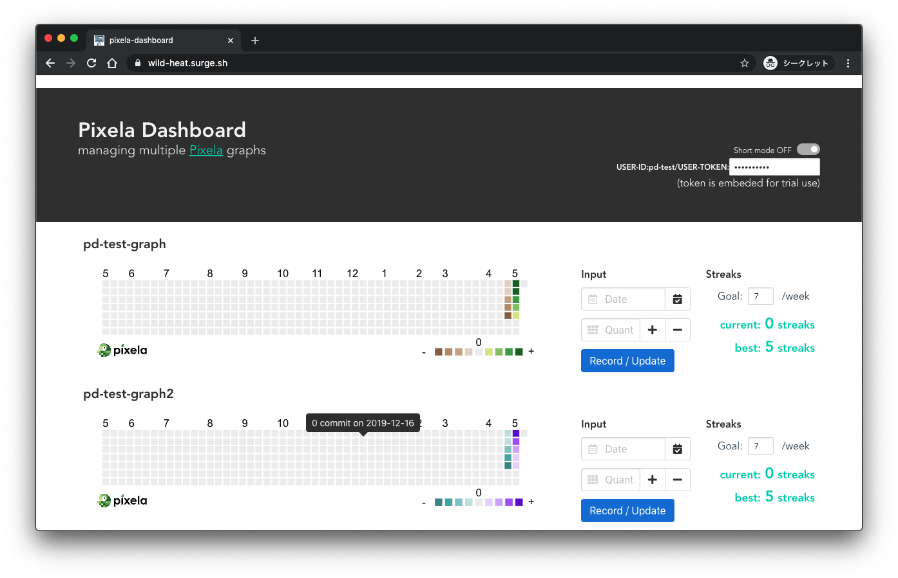
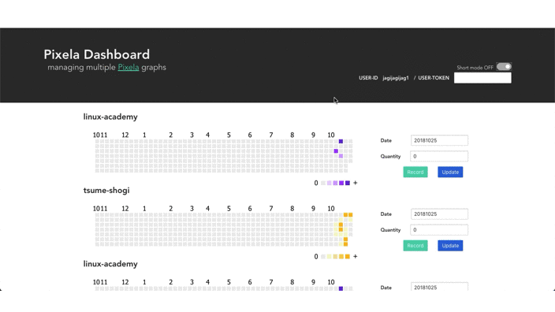

# pixela-dashboard
pixela-dashboard is an unofficial dashboard web app for [Pixela](https://pixe.la/) graphs.



The dashboard currently supports:
- view multiple graphs at a glance on a single page
- record / update pixels (data points) on the graphs
  - not support other actions, e.g. create user, create graph and delete pixel

#### 2018-10-25 now support short-mode! (you can toggle with upper-right switch)


#### 2019-03-08 support displaying svg with tippy


#### 2019-03-10 support displaying streaks for a graph


## Project setup
### 1. install
```
git clone https://github.com/jagijagijag1/pixela-dashboard
yarn install
```

### 2. set your pixela info

If you don't have user/graphs on Pixela, create your own at first.

Describe your pixela info to `src/pixela-config.json`
```json:src/pixela-config.json
{
  "user": "<your-user-id>",
  "graphs" : [
    "<your-graph-id-1>",
    "<your-graph-id-2>",
    "<your-graph-id-3>",
  ]
}
```

### 3. run locally or buid & deploy!

#### Compiles and hot-reloads for development
```
yarn run serve
```

then access to the `http://localhost:8080/`

#### Compiles and minifies for production
```
yarn run build
```

then put the files under `dist` to AWS S3 bucket or any other website hosting services as you like.
